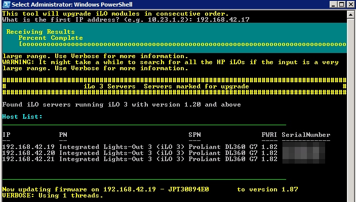

# HP iLO Firmware Updater
----

A simple powershell script design to batch update HP iLO regardless of iLO version. 

## Requirements
- A Windows PC running powershell
- Access to the latest bin files of HP iLO firmware. At the time of writing (5/4/2016) the iLo versions used by this script are:
	- iLo 2 - v2.29
	- iLo 3 - v1.20*
	- iLo 3 - v1.87
	- iLo 4 - v2.40
- Firmware bin files can be extracted from the .exe installers. By default the script will check C:\iLO for the version listed above. 
- HP Scripting Tools for Windows Powershell must be installed as well. [Link](http://h20566.www2.hpe.com/hpsc/swd/public/readIndex?sp4ts.oid=5440658&lang=en&cc=us)
	
**Note:** Servers running iLo 3 and the firmware version is older then v1.20 will be upgraded to 1.20 first before upgraded to the latest version of 1.87. Please make sure bin files for both ilo3_120.bin and ilo3_187.bin are stored in the iLo directory. 

## Getting Started  
 
 1. Run the PS1 file
 2. Type the network address of the first host. e.g. 192.168.1.20
 3. Type in the last octet of the final host e.g. 53
 4. The script will update all servers from 192.168.1.20-192.168.1.53
 4. The script will check the servers for which generation and version of iLO and will upgrade. Upgrading takes a long time so have a coffee while you wait. 

## Disclaimer

By using this script you accept any risks to your environment. As always test before using in production.

## Upcoming Features

* Error checking and validation for IP range.
* Check to see if firmware file exists. 