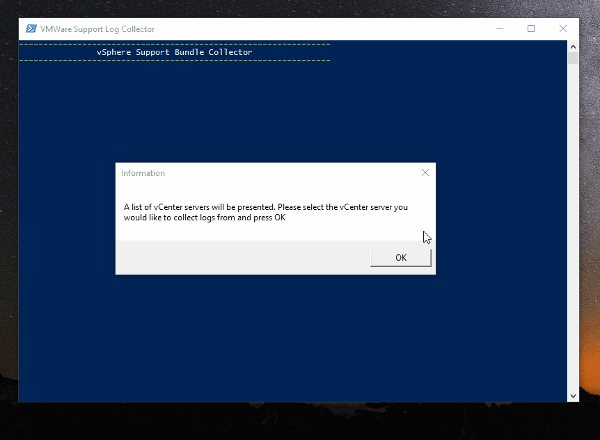

#vSphere Support Log Collector

This is a simple powershell script to help automate the process of (1) collect the vCenter or ESXi support logs and (2) uploading directly to VMWare via FTP. 

### Warning and Disclaimer
* Please note that FTP uploads are not encrypted.

### Requirements 

* This script leverages the PowerShell FTP Client Module. Please make sure to install the module before use. 
https://gallery.technet.microsoft.com/scriptcenter/PowerShell-FTP-Client-db6fe0cb
* Tested on Powershell v4.0, PowerCLI 6.0 R3 with ESXi 5.5 

### Demo

